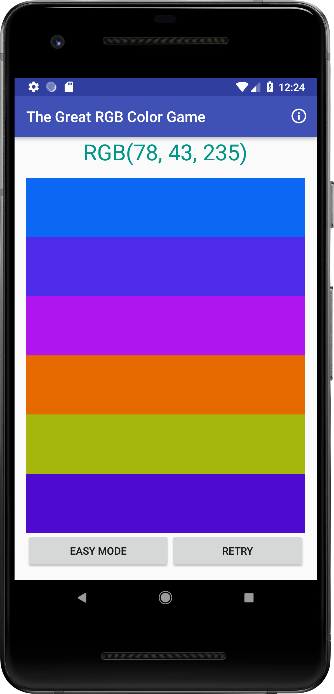

# not-fancy-rgb-color-game
A simple, not fancy at all, RGB Color Game. Guess the color from the given RGB Code
Built for [#NotFancyAppChallenge](https://github.com/samanthaming/awesome-notfancyappchallenge) by [@samanthaming](https://github.com/samanthaming/)

Features:
- Two modes - Easy (3 color) & Hard (6 color)

Built using
- Android Studio
- Java
- XML
- [Material About](https://github.com/jrvansuita/MaterialAbout)

# Screenshot

